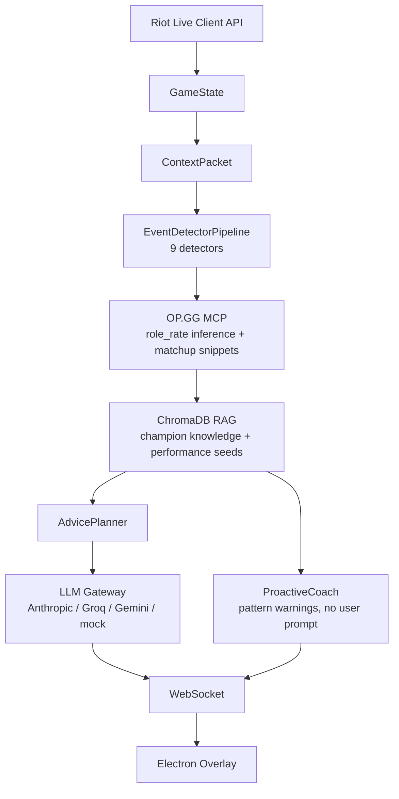

# RiftBuddy - Real-time AI Inference Platform for League Coaching

[Demo GIF - record with `RIFTBUDDY_TEST_MODE=1 LLM_PROVIDER=mock`]

RiftBuddy turns live League of Legends telemetry into short, grounded coaching advice inside an Electron overlay. It combines deterministic event detection, OP.GG matchup data, local ChromaDB retrieval, an advice planning layer, and multi-provider LLM dispatch so the model receives structured game context instead of a raw prompt dump.

## What it does

- Polls the Riot Live Client API every 3 seconds and normalizes the current game state.
- Detects urgent game events such as low health, death streaks, CS drops, vision risk, item spikes, and objective windows.
- Pulls OP.GG MCP matchup/counter data and infers the likely lane opponent using role-rate data.
- Builds Riot Match-V5 CS benchmarks for tier/role/champion comparisons, such as Diamond ADC CS/min.
- Retrieves champion knowledge and personal performance seeds from ChromaDB.
- Plans the advice mode before LLM dispatch: defensive, recall, macro, or general coaching.
- Injects live CS pace into regular advice when `RIOT_API_KEY` is configured.
- Pushes requested advice and proactive pattern warnings to the Electron overlay over WebSocket.
- Saves post-game performance seeds enriched with OP.GG score, build, tier, and score timeline trends.

## Architecture



## Key Technical Challenges

**Low-latency inference context:** RiftBuddy keeps the LLM path small by converting live telemetry into typed events, ranked knowledge snippets, and an advice plan before provider dispatch.

**Grounded game intelligence:** OP.GG MCP responses, Riot Match-V5 CS benchmarks, champion knowledge, and historical performance seeds are merged into the prompt so advice reflects matchup data, farm pace, and the player's repeated mistakes.

**Proactive coaching loop:** After-game seeds are reused during future games. If the player approaches a historically dangerous timing window, RiftBuddy sends a warning in the same AI coach chat without waiting for a user prompt.

**Demo-safe portfolio mode:** `RIFTBUDDY_TEST_MODE=1` and `LLM_PROVIDER=mock` run the coaching loop without a live LoL game or paid LLM keys, making the project easy to evaluate.

## Evaluation Results

`python evals/run_evals.py`

| Scenario          | Events                                | Mode      | Contains | Latency | Result |
| ----------------- | ------------------------------------- | --------- | -------- | ------- | ------ |
| cs_drop_warning   | CS_DROP, VISION_WARNING               | MACRO     | pass     | 0ms     | PASS   |
| death_streak_tilt | DEATH_STREAK, CS_DROP, VISION_WARNING | DEFENSIVE | pass     | 0ms     | PASS   |
| gold_spike_recall | GOLD_SPIKE, VISION_WARNING            | RECALL    | pass     | 0ms     | PASS   |
| low_health_danger | LOW_HEALTH, VISION_WARNING            | DEFENSIVE | pass     | 0ms     | PASS   |
| macro_default     | none                                  | MACRO     | pass     | 0ms     | PASS   |
| vision_warning    | VISION_WARNING, GOLD_SPIKE            | MACRO     | pass     | 0ms     | PASS   |

Summary: **6/6 scenarios passed**, average mock latency **0ms**.

## Quick Start

```bash
python -m venv .venv
source .venv/bin/activate
pip install -r requirements.txt
cp .env.example .env
```

Run the backend in demo mode:

```bash
RIFTBUDDY_TEST_MODE=1 LLM_PROVIDER=mock python -m uvicorn backend.main:app --reload --port 8001
```

Run the Electron overlay:

```bash
cd frontend
npm install
npm run dev
```

Health check:

```bash
curl http://localhost:8001/health
```

## Hotkeys

| Hotkey                     | Action                   |
| -------------------------- | ------------------------ |
| `Command/Ctrl + Shift + B` | Planned in-game advice   |
| `Command/Ctrl + Shift + C` | OP.GG matchup stats      |
| `Command/Ctrl + Shift + 1` | Item recommendation      |
| `Command/Ctrl + Shift + 2` | Macro/objective advice   |
| `Command/Ctrl + Shift + D` | Show/hide draft window   |
| `Command/Ctrl + Shift + L` | Toggle response language |

## Environment Variables

Use `.env.example` as the template. Do not commit real secrets.

```bash
ANTHROPIC_API_KEY=
SUPABASE_URL=
SUPABASE_ANON_KEY=
RIOT_GAME_NAME=
RIOT_TAG_LINE=
RIOT_REGION=KR
RIOT_BENCHMARK_TIER=DIAMOND
RIOT_BENCHMARK_SAMPLES=25
RIOT_BENCHMARK_MATCHES_PER_PLAYER=3
RIOT_BENCHMARK_TTL_SECONDS=604800
LLM_PROVIDER=mock
RIFTBUDDY_RESPONSE_LANGUAGE=ko
RIFTBUDDY_TEST_MODE=1
```

## Tests

```bash
python -m pytest backend/tests/ -q
cd frontend && npm test
python evals/run_evals.py
```

## Resume

<details>
<summary>Resume bullets</summary>

**Standard**

Built a real-time AI League coaching overlay with FastAPI, WebSockets, Electron, Riot Live Client API, and multi-provider LLM integration; added 9-detector event pipeline, OP.GG MCP live data integration, champion knowledge RAG, advice planning layer, proactive pattern-based coaching from historical seeds, and automated eval suite.

**Strong**

Designed a real-time AI inference platform for League of Legends that transforms live game telemetry into prioritized coaching signals via a deterministic event detection pipeline, OP.GG MCP live matchup data, Riot Match-V5 CS benchmark aggregation, champion and matchup knowledge retrieval with ChromaDB, and an advice planning layer before LLM dispatch. Includes proactive coaching that auto-triggers pattern-based warnings from historical performance seeds without user prompting.

</details>
